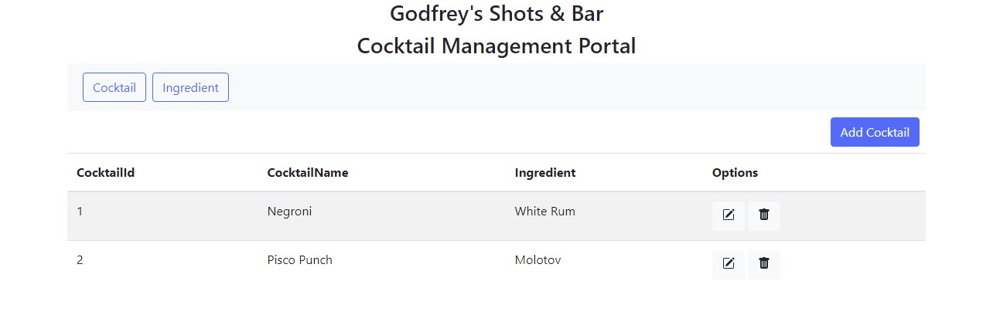

# About The Project

- This is a restful API with a frontend.
- It is a simple project which can create, read, update and delete data from a database.
- It also consumes a REST API from a third party.

## Features
- It can create, read, update and delete **cocktails** and its respective **ingredient(s)** from a database.
- It displays uses pagination to display 5 cocktails and ingredients for every page.
- It has separete pages for **cocktails** and **ingredients**.
- It has a **search** feature to search for a specific cocktail or ingredient.
- It has a **filter** feature to filter cocktails by ingredient.
- It has a **sort** feature to sort cocktails by ingredient.

## Built With
- [Python](https://www.python.org/)
- [Django](https://www.djangoproject.com/)
- [TypeScript](https://www.typescriptlang.org/)
- [Sqlite3](https://www.sqlite.org/)
- [Bootstrap](https://getbootstrap.com/)
- [JQuery](https://jquery.com/)
- [AJAX](https://en.wikipedia.org/wiki/Ajax_(programming))
- [JSON](https://en.wikipedia.org/wiki/JSON)
- [REST](https://en.wikipedia.org/wiki/Representational_state_transfer)
- [HTML](https://en.wikipedia.org/wiki/HTML)
- [CSS](https://en.wikipedia.org/wiki/Cascading_Style_Sheets)
- [Git](https://git-scm.com/)
- [GitHub](https://github.com/)
- [Heroku](https://www.heroku.com/)

## Installation
- Clone the repo:

      `git clone https://github.com/godfreyowidi/django-angular-cocktail-app.git`

- After you cloned the repository, you want to create a virtual environment, so you have a     clean python installation. You can do this by running the command
  
      `python3 -m venv venv`

- After this, it is necessary to activate the virtual environment, you can get more information about this by running the command:
  
      `source venv/bin/activate`

- Install the dependencies with the following command:

      `pip install -r requirements.txt`

- Run the following command to migrate the database:

      `python manage.py makemigrations`

- Run the following command to run the app:

      `python manage.py runserver`

## License
The MIT License (MIT)
Copyright © 2022 <copyright holders>

Permission is hereby granted, free of charge, to any person obtaining a copy of this software and associated documentation files (the “Software”), to deal in the Software without restriction, including without limitation the rights to use, copy, modify, merge, publish, distribute, sublicense, and/or sell copies of the Software, and to permit persons to whom the Software is furnished to do so, subject to the following conditions:

The above copyright notice and this permission notice shall be included in all copies or substantial portions of the Software.

THE SOFTWARE IS PROVIDED “AS IS”, WITHOUT WARRANTY OF ANY KIND, EXPRESS OR IMPLIED, INCLUDING BUT NOT LIMITED TO THE WARRANTIES OF MERCHANTABILITY, FITNESS FOR A PARTICULAR PURPOSE AND NONINFRINGEMENT. IN NO EVENT SHALL THE AUTHORS OR COPYRIGHT HOLDERS BE LIABLE FOR ANY CLAIM, DAMAGES OR OTHER LIABILITY, WHETHER IN AN ACTION OF CONTRACT, TORT OR OTHERWISE, ARISING FROM, OUT OF OR IN CONNECTION WITH THE SOFTWARE OR THE USE OR OTHER DEALINGS IN THE SOFTWARE.
